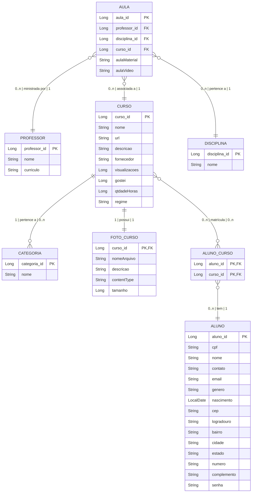

```mermaid
erDiagram
    ALUNO {
        Long aluno_id PK
        String cpf
        String nome
        String contato
        String email
        String genero
        LocalDate nascimento
        String cep
        String logradouro
        String bairro
        String cidade
        String estado
        String numero
        String complemento
        String senha
    }

    PROFESSOR {
        Long professor_id PK
        String nome
        String curriculo
    }

    CATEGORIA {
        Long categoria_id PK
        String nome
    }

    CURSO {
        Long curso_id PK
        String nome
        String url
        String descricao
        String fornecedor
        Long visualizacoes
        Long gostei
        Long qtdadeHoras
        String regime
    }

    DISCIPLINA {
        Long disciplina_id PK
        String nome
    }

    AULA {
        Long aula_id PK
        Long professor_id FK
        Long disciplina_id FK
        Long curso_id FK
        String aulaMaterial
        String aulaVideo
    }

    FOTO_CURSO {
        Long curso_id PK,FK
        String nomeArquivo
        String descricao
        String contentType
        Long tamanho
    }

    ALUNO_CURSO {
        Long aluno_id PK,FK
        Long curso_id PK,FK
    }

    %% RELACIONAMENTOS COM CARDINALIDADE %%
    CURSO ||--o{ CATEGORIA : "1 | pertence a | 0..n"
    CURSO }o--o{ ALUNO_CURSO : "0..n | matrícula | 0..n"
    ALUNO_CURSO }o--|| ALUNO : "0..n | tem | 1"
    
    CURSO ||--|| FOTO_CURSO : "1 | possui | 1"
    
    AULA }o--|| PROFESSOR : "0..n | ministrada por | 1"
    AULA }o--|| DISCIPLINA : "0..n | pertence a | 1"
    AULA }o--|| CURSO : "0..n | associada a | 1"
```
