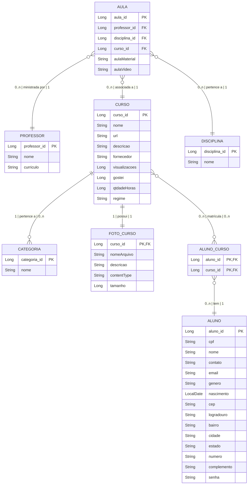

# Portal Social API


Este projeto foi desenvolvido como parte do desafio do bootcamp DIO-BRADESCO, implementando uma API REST para um sistema de cadastro de cursos utilizando Java 17 e Spring Boot 3.

## 📋 Sobre o Projeto

Portal Social API é uma plataforma que permite o gerenciamento de cursos, instrutores, categorias e alunos. A API facilita o cadastro, consulta e manutenção de informações relacionadas a cursos educacionais, com suporte para upload de imagens.

### Diagrama ER




## 🛠️ Tecnologias Utilizadas

- **Java 17**: Linguagem de programação com recursos modernos
- **Spring Boot 3**: Framework para desenvolvimento simplificado de aplicações Java
- **Spring Data JPA**: Facilitador para implementação de repositórios baseados em JPA
- **Spring MVC**: Para criação de endpoints REST
- **MySQL**: Banco de dados relacional utilizado em desenvolvimento e produção
- **Flyway**: Gerenciamento de migrações de banco de dados
- **Lombok**: Redução de código boilerplate em classes Java
- **ModelMapper**: Mapeamento entre entidades e DTOs
- **Swagger/OpenAPI**: Documentação interativa da API
- **AWS S3**: Armazenamento opcional de imagens em nuvem

## ✨ Características Principais

### Manipulação de Dados Multipart
A API não se limita a processar apenas JSON, mas também trabalha com `multipart/form-data`, permitindo o upload de arquivos JPEG para os cursos.

### Uso do Flyway com MySQL em Desenvolvimento
Em vez de utilizar o H2 em memória, o projeto optou pelo uso do MySQL diretamente no ambiente de desenvolvimento, através do Flyway, trazendo as seguintes vantagens:

1. Ambiente de desenvolvimento mais próximo da produção
2. Testes mais realistas com o mesmo dialeto SQL
3. Melhor detecção de problemas de desempenho
4. Transição suave entre ambientes
5. Persistência do esquema entre reinicializações

### Arquitetura de Mapeamento Otimizada
Duas classes abstratas foram criadas para padronizar e simplificar o mapeamento entre entidades e DTOs:
- `EntityDtoAssembler`: Responsável pelo mapeamento de entidades para DTOs
- `EntityInputDisassembler`: Responsável pelo mapeamento de DTOs de entrada para entidades

### Armazenamento Flexível de Imagens
O sistema implementa uma estratégia flexível para armazenamento de imagens dos cursos:
1. Armazenamento local no servidor
2. Armazenamento em nuvem usando AWS S3

Esta configuração é controlada através de parâmetros no arquivo YAML.

### Tratamento de Exceções Padronizado
Um handler específico para exceções foi implementado seguindo o formato definido na RFC 7807 (Problem Details for HTTP APIs), garantindo respostas de erro consistentes e informativas.

### Logs Personalizados
Um arquivo XML de configuração foi adicionado para personalizar as cores dos logs no console do Spring Boot, melhorando a legibilidade durante o desenvolvimento.

### Requisições HTTP
Um arquivo JSON `http_requests_insomnia.json` contem requisições HTTP para os endpoints implementados, para ser utilizado com o Insomnia


## 🚀 Como Executar

1. Clone o repositório - Deve haver uma instancia do banco MySQL rodando na máquina.
```bash
git clone https://github.com/rgiovann/dio-bradesco-publicando-sua-api-rest-usando-java17-springboot3.git
```

2. Configure as propriedades do banco de dados no arquivo `application.yml`. Nota: A porta utilizada não é a padrão do MySQL, altere a senha root de acordo.

3. Execute o projeto
```bash
./mvnw spring-boot:run
```

## 📝 Status do Projeto

⚠️ **WIP (Work In Progress)**: Este projeto ainda está em desenvolvimento, com algumas funcionalidades planejadas ainda não implementadas.

> Nota: Não foi utilizado o Railway para deploy do projeto devido ao esgotamento dos créditos associados à conta do GitHub.


## 👨‍💻 Autor

Desenvolvido como parte do bootcamp DIO-BRADESCO.

